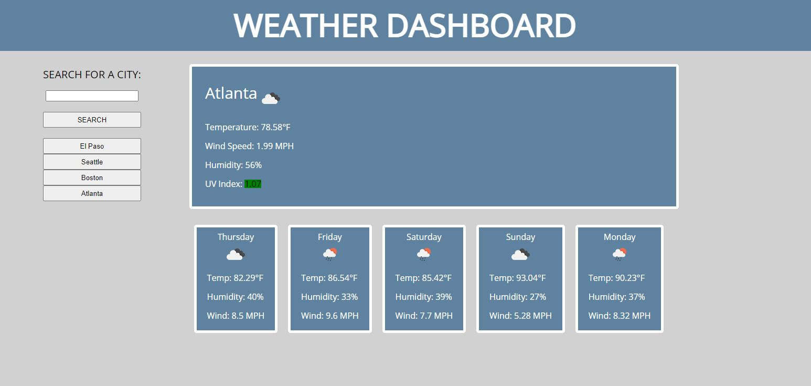

# Week6-WeatherAPI-CP
This is Corey Parker's week 6 homework, Weather API.

This project uses Open Weather's weather API to allow the user to input the city of their choice and return the current weather and a 5 day forecast. Additionally, their previous searches are saved to local storage so that they can select the city again to see its weather.

The technologies used in this applciation are HTML, CSS, JS, and the Open Weather Map API.

Link to live program: https://coreyparker12.github.io/Week6-WeatherAPI-CP/

I can be contacted at coreyparker012@gmail.com

